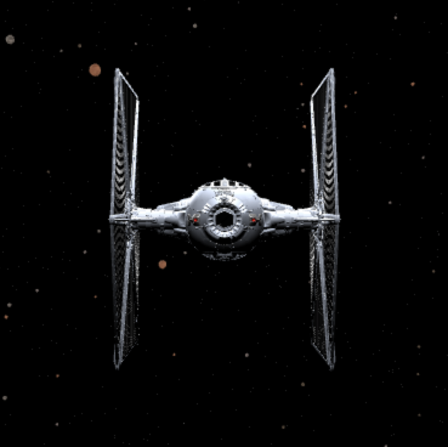
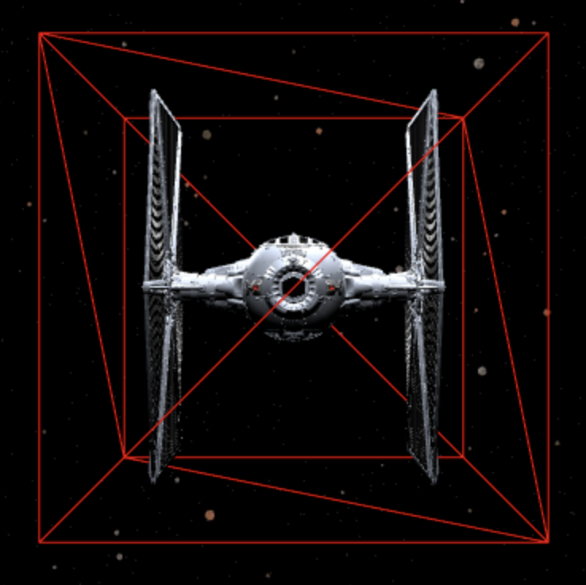
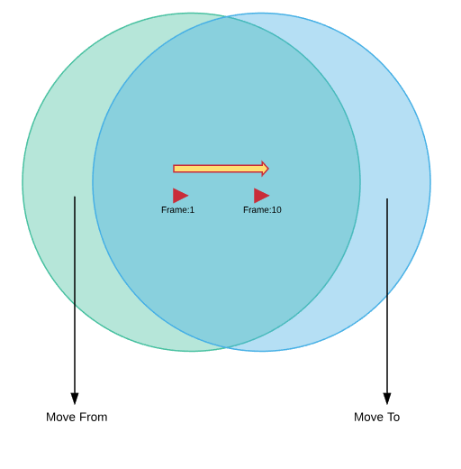

# FLIGHT GL

### By Alan Negrete and Tarek Yacoub

## Implementation

Created a space flight game that uses THREEJS and the gamepad api to allow controlers. Implemented Controlers are the Saitek X52 flight system,
and the PS3 controler.

Flightgl games loop is maxed at 60 frames per second. So at a max the game will call the update function 60 times. On the other hand the game loop will call the draw function in each animation frame.

```typescript
private loop(): void {
    const timestamp = window.performance.now(); // get current timestamp

    if (timestamp < this.lastFrameTimeMs + LOOP_MULTIPLIER / MAX_FPS) {
      requestAnimationFrame(() => {
        this.loop();
      });
      return;
    }
    this.delta += timestamp - this.lastFrameTimeMs;
    this.lastFrameTimeMs = timestamp;

    if (timestamp > this.lastFpsUpdate + LOOP_MULTIPLIER) {
      this.fps = 0.25 * this.framesThisSecond + 0.75 * this.fps;

      this.lastFpsUpdate = timestamp;
      this.framesThisSecond = 0;
    }

    this.framesThisSecond++;

    var numUpdateSteps = 0;
    while (this.delta >= TIMESTAMP) {
      this.update(TIMESTAMP / LOOP_MULTIPLIER);
      this.delta -= TIMESTAMP;
      if (++numUpdateSteps >= MAX_STEPS) {
        this.delta = 0;
        break;
      }
    }

    this.draw(this.delta / TIMESTAMP);

    requestAnimationFrame(() => {
      this.loop();
    });
  }
```

In our update loop we have three different objects that updated, Enviroment, Collision, and Physics. The three of those implement our Engine interface

```typescript
export interface Engine {
  update(delta: number): void;
}
```

and are called as such in the update loop.

```typescript
private update(delta: number): void {
    this.environment.update(delta);
    ...
    this.physics.update(delta);
    this.collision.update(delta);
  }
```

## Raycasting

### Without Hitbox



Raycasting takes a vertices, and returns the distance between that vertics and all the other materials that it collides with. Therefore, we initially had to loop through ~2000 that are on the outer edges of the tie fighter. That caused the performence to be very low, making the game unplayable. Thus we had to figure out a better way to do collision detection.

### With Hitbox



We decided to create a transperent hit box that enclose the tie fighter object. That reduced our loop from 2000 vertices to 8 (hit box vertices).

## Enviroment Generation



Procedurally checking the Object's position is far enough that it should be updated and also taking into account the Frustum to ensure that the object that will update is behind the Perspective View of the Camera that the current player is on.

```typescript
let distance = obj.position.distanceTo(this.pCamera.position);
if (distance > this.radius) {
  let frustum = new Frustum();
  let cameraViewProjectionMatrix = new Matrix4();
  this.pCamera.matrixWorldInverse.getInverse(this.pCamera.matrixWorld);
  cameraViewProjectionMatrix.multiplyMatrices(
    this.pCamera.projectionMatrix,
    this.pCamera.matrixWorldInverse
  );
  frustum.setFromMatrix(cameraViewProjectionMatrix);

  if (!frustum.intersectsObject(obj)) {
    const updatedPos = this.geratePosition();
    obj.position.set(updatedPos.x, updatedPos.y, updatedPos.z);
    return obj;
  }
  return null;
}
```

Setting up the new position was pretty straight forward, kept it simple and just ensured that we placed it in the distance in front of the current camera's perspective.

```typescript
  private geratePosition() {
    let updatedZ = this.radius * 0.8;
    let updatedPos = new Vector3(
      this.getRandomPosNegNumber(this.radius * 0.75),
      this.getRandomPosNegNumber(this.radius * 0.75),
      this.pCamera.position.z >= 0 ? updatedZ : -updatedZ
    );
    this.pCamera.matrixWorldInverse.getInverse(this.pCamera.matrixWorld);
    updatedPos.applyMatrix4(this.pCamera.matrixWorld);
    return updatedPos;
  }
```

To optimize we just kept the objects in a sorted list based on their distance, we have thousands of
Meshes on our Scene so obviously looping through all of them dropped the FPS to single digits. To improve that, we moved these updates to the physics updates, not the draw.

```typescript
  private asteroidSort() {
    this.asteroids.sort((a: any, b: any) => {
      const distanceA = this.pCamera.position.distanceTo(a.position);
      const distanceB = this.pCamera.position.distanceTo(b.position);
      return distanceA - distanceB;
    });
  }
```

## Multiplayer

We added support for multiplayer, we use websockets to synchronize the world positions and rotations of the tie fighters.

## Setup

<h3>Install dependencies:</h3>

    yarn

<h4>or</h4>

    npm i

<h3>Run project</h3>

    npm start

<h3>Compile code to bundle</h3>

    webpack
